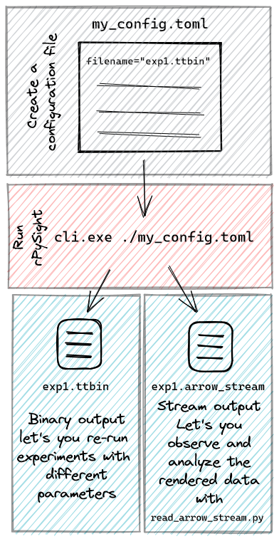

# rPySight

Real-time rendering of photon streams in 2D and 3D arriving from a [TimeTagger](https://www.swabianinstruments.com/time-tagger/), full project published in [Har-Gil et al 2022 Neurphothonics 9(3): 039120](https://www.spiedigitallibrary.org/journals/neurophotonics/volume-9/issue-3/031920/Versatile-software-and-hardware-combo-enabling-photon-counting-acquisition-and/10.1117/1.NPh.9.3.031920.full)

## Motivation

Photon counting is an imaging approach where detected photons are discriminated before being digitized, eliminating a large source of error from typical brightness measurements in the live imaging world, especially using two-photon microscopes. While this approach ultimately provides better-looking images, it also suffers from a higher entry bar and a general lack of advocates in the (neuroscientific) imaging community.  However, once photon counting is fully implemented it can also help experimenters to introduce other advanced imaging modalities, such as volumetric imaging. 

## Introduction

rPySight aims to ameliorate some of the difficulties in implementing photon counting by providing researchers and users with a high quality application for the rendering part of the photon counting microscope. Together with proper hardware (the previously mentioned TimeTagger) implementing photon counting should be quite easy and within reach for most users, even the less tech-savvy ones. We, at the lab of [Dr. Pablo Blinder](http://pblab.tau.ac.il/en/), already provided a solution for these issues in the form of [PySight](https://github.com/PBLab/python-pysight), a Python package that achieves similar goals. However, PySight had one major deficit (besides its [sub-par lead contributor](https://github.com/PBLab/python-pysight/graphs/contributors)) - it did its magic offline, which added an exhausting post-processing step for experimenters, and also meant that you're never quite sure how did the imaging session go until you've analyzed the data.

rPySight's main _raison d'être_ is the fact that it shows the same data but in **real time.** This is possible due to a few technical upgrades and changes done at the hardware and software level, but the main benefit is clear - experimenters can again see their samples during the imaging session. Moreover, rPySight even does real-time 3D rendering of data captured with a [TAG lens](https://www.mitutoyo.com/taglens/). This novel feat is more than an incremental quality-of-life improvement, by allowing TAG lens users to have live feedback during their experiments, rather than having a mediocre Z-projected image to work with.

## A Few Technical Details and Requirements

This project is a mixed Rust-Python project - most of the work is done with Rust, but Python is required to start the TimeTagger and stream the data from it to the Rust renderer. You may use [maturin](https://github.com/PyO3/maturin)to more easily build the project locally. Thus a recent Rust compiler (when building from soure) and an updated Python version are needed to run this project. Needless to say, a working and installed TimeTagger is also required.

## Installation and Usage

A detailed protocol can be found in the accompanying manuscript (currently being written), or in the [tutorial file](https://github.com/PBLab/rpysight/blob/main/TUTORIAL.md) provided in this repo.

### Install from source (recommended)

Download a Rust compiler, preferably using [rustup](https://rustup.rs/), clone the repo and run `cargo build --release`. Next, go to `rpysight/call_timetagger.py` and modify the marked directories there to point to your existing TimeTagger installation. To run, use `cargo run --release CONFIG_FILENAME`, where the configuration filename is a custom configuration file you created (a default one can be found under the `resources` folder). There's also a GUI available using `cargo run --release --bin gui`, but it's a bit more clunky at the moment.

### Download binary file

Download the binary from the Releases page and run it in your shell.

### Usage

Using rPySight is quite simple and can be boiled down to following these simple steps:

More information can be found in the [tutorial](https://github.com/PBLab/rpysight/blob/main/TUTORIAL.md), or by contacting the authors of this work.
### Outputs

rPySight generates two main outputs with names similar to the ones in the "filename" field of the configuration file. The first is a `.ttbin` file that can be used to replay old experiments and generally have access to the raw data as it arrived from the TimeTagger. The second is an `.arrow_stream` file, which is a table of coordinates and data (i.e. a sparse matrix) that can be used to create the same rendered volumes but in post-processing. An example for such processing in Python may be found in the `rpysight` directory.
